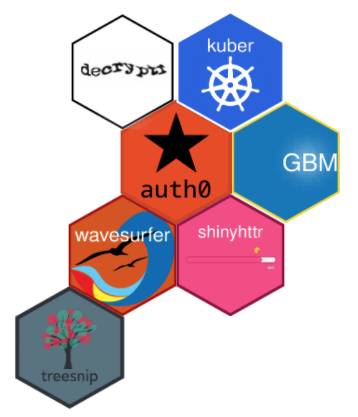
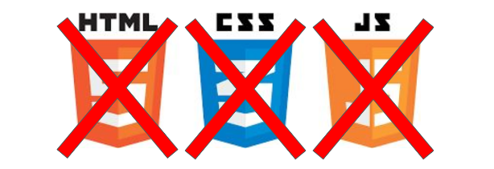
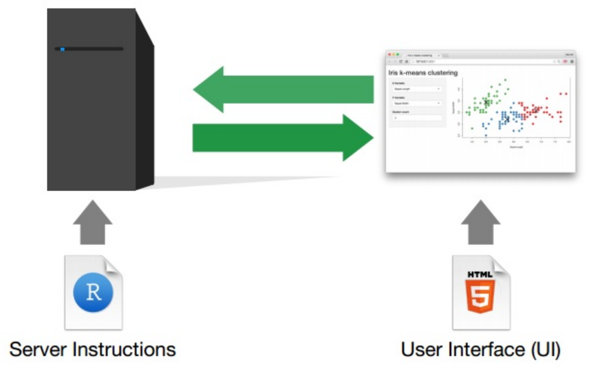
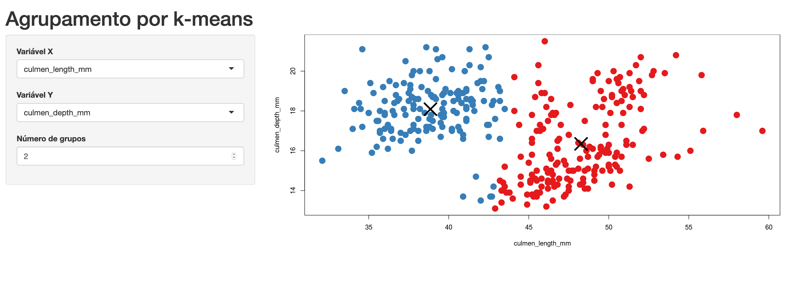
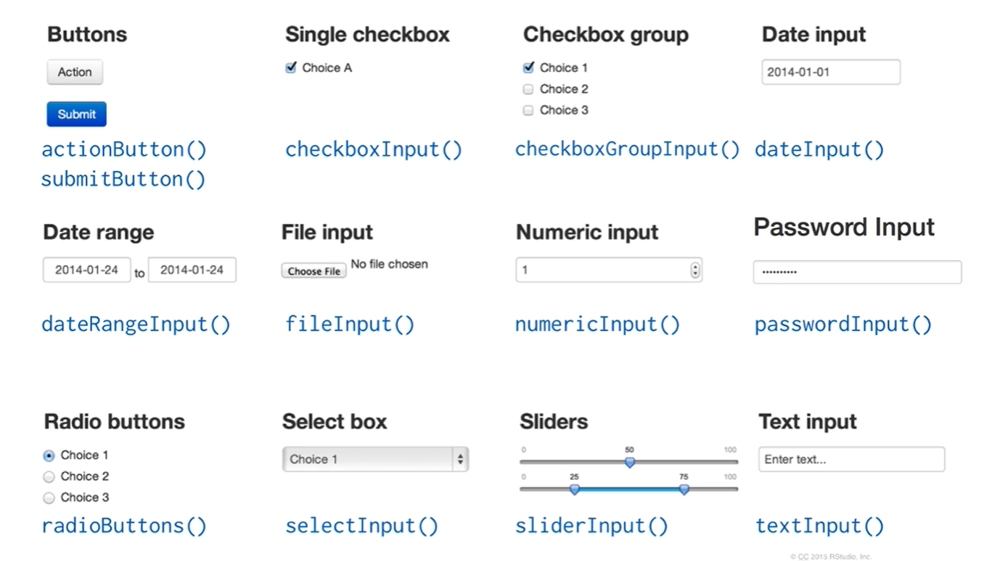

```{r, child="00-preamble.Rmd"}

```

```{r setup, include=FALSE}
options(htmltools.dir.version = FALSE)
```

class: middle, center

# Sobre

---
class: middle, center

## Sobre a Curso-R

.pull-left[
```{r, echo = FALSE}
knitr::include_graphics("https://d33wubrfki0l68.cloudfront.net/295643c6243701ae6a9bac3fb8ad467ff0ce3c84/d1785/img/logo/cursor1-41.png")
```

<br>
<br>

```{r, echo = FALSE}

```

]

.pull-right[
```{r, echo = FALSE}

```
]

### [www.curso-r.com](https://www.curso-r.com)

---
## Sobre a apresentação

- Primeira hora: introdução ao Shiny para quem nem sabe o que é Shiny. 

> **Objetivo**: aprendermos a construir um aplicativo simples e colocá-lo na internet.

<br>

- Segunra hora: apresentação de diversos recursos legais do Shiny.

> **Objetivo**: sairmos pessoas motivadas a aprender mais.

---
class: middle, center

# Introdução ao Shiny

---
## Shiny: programando em HTML sem saber HTML

Com o Shiny, podemos produzir aplicativos web em HTML, CSS e JavaScript sem saber programar nessas linguagens. E melhor: sem sair do R!

<br><br>


<center>


<br>
Fonte: <a href = http://www.rstudio.com/shiny/>rstudio.com/shiny/</a>
</center>

---

## Dashboards dinâmicos

<center>

<br>
Fonte: <a href = http://www.rstudio.com/shiny/>rstudio.com/shiny/</a>
</center>

---
class: center, middle

## [Exemplo de Shiny app em produção](https://rseis.shinyapps.io/exemplos/)

---
## Exemplo mínimo

O código de qualquer aplicativo em Shiny terá a estrutura abaixo:

- Um objeto chamado `ui`.

- Uma função chamada `server`.

- Uma chamada da função `shinyApp()`.

```{r, eval=FALSE}
library(shiny)

ui <- fluidPage("Olá, mundo!")

server <- function(input, output, session) {
  
}

shinyApp(ui, server)
```

No RStudio, para rodar um aplicativo shiny localmente (o seu computador é o servidor), clique no botão **Run app** logo acima do script.

---
## Exemplo

Vamos criar e rodar o exemplo minimal do slide anterior.

<center>

<br>
<br>
`r blue('Ao RStudio: 01-ola-mundo.R')`
<center>

---
## Inputs e Outputs

Fazer um shiny app tem duas grandes tarefas: a construção do layout (veremos mais a frente) e a construção dos inputs e outputs.

<center>

</center>

---
## Outputs: tabelas, gráficos e muito mais!

Outputs representam as *saídas* do nosso aplicativo, isto é, tudo que queremos que nosso código R retorne para o usuário. Essas saídas podem ser tabelas, gráficos, mapas, texto, imagens ou qualquer outro elemento em HTML.

Os outputs são definidos no UI e criados no server. Cada tipo de output é definido por uma função do tipo `_Output()`. Veja as principais:

```{r, echo = FALSE, eval=TRUE}
tibble::tribble(~Função, ~Output,
                "imageOutput()", "imagens",
                "plotOutput()", "gráficos",
                "tableOutput()", "tabelas",
                "textOutput()", "textos") %>%
  knitr::kable(format = "html")
```

---
## Funções render

Para criar um output, precisamos das funções do tipo `render_()`. Essas funções são responsáveis por conectar as nossas visualizações criadas pelo R com o código HTML do UI. Na grande maioria dos casos, teremos o par `visualizacaoOutput()` `renderVisualizacao()`. 

Veja a seguir as principais funções `render_()` e como elas se comunicam com as funções `_Output()`.

```{r, echo = FALSE, eval=TRUE}
tibble::tribble(~`_Output()`, ~`render_()`,
                "imageOutput()", "renderImage()",
                "plotOutput()", "renderPlot()",
                "tableOutput()", "renderTable()",
                "textOutput()", "renderText()") %>%
  knitr::kable(format = "html")
```


---

## Atividade

Vamos criar e rodar um shiny app com um gráfico como output.

<br>

<center>

<br>
<br>
`r blue('Ao RStudio: 02-output.R')`
<center>

---
## Inputs: dê controle ao usuário

Inputs permitem que o usuário interaja com o seu aplicativo. Eles são criados no UI com funções (geralmente) do tipo `_Input()` e são utilizados dentro do server para alterar as visualizações. Veja alguns exemplos abaixo e acesse [este link](https://shiny.rstudio.com/gallery/widget-gallery.html) para testar como eles funcionam no navegador.

<center>

<br>
Fonte: <a href = http://www.rstudio.com/shiny/>rstudio.com/shiny/</a>
</center>

---
## Atividade

Vamos colocar um seletor de variáveis no exemplo anterior para permitir que o usuário escolha qual variável será exibida no histograma.

<br>

<center>

<br>
<br>
`r blue('Ao RStudio: 03-output-input.R')`
</center>

---
## Shinyapps.io

O [shinyapps.io](https://www.shinyapps.io/) é um serviço do RStudio para hospedagem de Shiny apps.

A conta gratuita permite você ter até 5 aplicações e 25 horas mensais de uso (um aplicativo utilizado por 1 hora consome 1 hora do seu plano, 2 aplicativos utilizados simultaneamente por 1 hora consomem 2 horas do seu plano).

Criada uma conta, você poderá subir o seu app para o shinyapps.io diretamente do RStudio. Para isso, você precisará apenas conectar a sua conta com o RStudio.

[Neste vídeo](), mostramos como conectar o shinyapps.io com o RStudio.

---
## Atividade

Vamos conectar o nosso RStudio com o shinyapps.io e subir um app para lá.

<br>

<center>

<br>
<br>
`r blue('Ao RStudio: shinyapps/03-output-input.R')`
</center>

---
## Referências e material extra

### Tutoriais

- [Tutorial de Shiny do Garrett Grolemund](https://shiny.rstudio.com/tutorial/)

- [Mastering Shiny](https://mastering-shiny.org/)

#### Galeria de Exemplos

- [Galeria do Shiny](https://shiny.rstudio.com/gallery/)

- [Site Show me Shiny](https://www.showmeshiny.com/)
